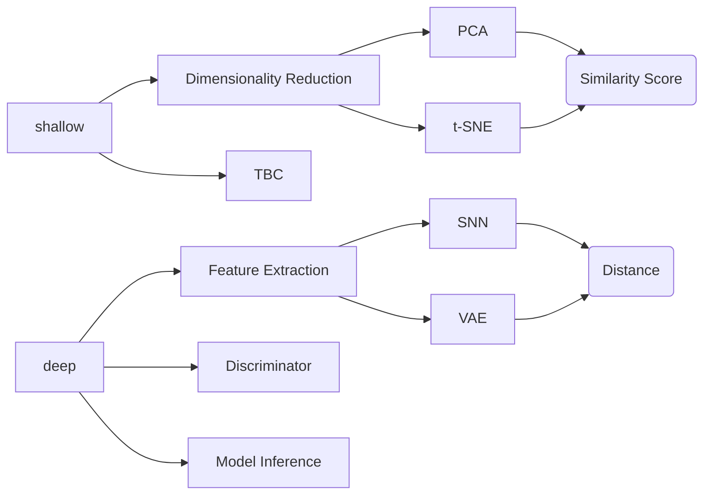

# PackageName
## About
'Package name' is result of a project funded by the Alan Turing Institute. Packagename is a Python library for evaluating synthetic data quality across a wide range of data types (image, tabular, time series, language) and approaches to evaluation. Synthetic data is a crucial part of many machine learning,  data science and other  applications. The performance of these applications relies on the  ‘quality’ and diversity of the synthetic data used. We understand that no clear definition of ‘quality’ (where quality is a measure of how indistinguishable the synthetic data is from the real data) exist in relation to synthetic data. In this package we provide an expanding list of metrics that open sourced and community driven. 

The following approaches to evaluation are currently provided:
- Inception Score
- Frechet Inception Distance
- Deep Discriminator
- t-SNE
- PCA followed by
  - IoU
  - DICE



# Using Packagename

## Getting Started

### Prerequisites

Python 3.8 - 3.10  

*We highly recommand that uses the version between 3.8 and 3.10. With these versions, dependencies can be installed properly.


### Installation

After cloning the repo into a new directory, make a virtual environment called 'venv', activate it, and install the dependencies using pip tool, e.g.

``` shell
python3 -m venv venv
source venv/bin/activate
pip install -r requirements.txt
```

**Note: the requirements file contains all the dependencies needed, and it works well when the version of python is in the mentioned range.**

Once finished   

```
deactivate
```

## Extracting Metrics

Packagename can be utilised to analysing synthetic *image, time-series, tabular and language* data with 4 simple steps:

1) Load the Packagename `evaluator` object
2) Load in your `data`
3) Create the corresponding datatype evaluator `<datatype>_evaluator(data)` 
4) Call the desired metric `evaluator.<metric>()`

We handle the rest.

### Synthetic Image Evaluator Example

Load in the evaluator object
```python
from synthetic_data_metrics import evaluator
```

Load in your data as one/two numpy arrays `size = [n_samples,H,W,C]`:
```python
images, _, _, _ = load_cifar10()
```

Intialise the image evaluator and feed in your data:

```python
img_evaluator = evaluator.Image_Evaluator(synth, real)
```

Call your desired metric(s):
```
img_evaluator.inception_score(n_splits=20)
img_evaluator.dim_reduced_iou_score()
img_evaluator.dim_reduced_dice_score()
img_evaluator.plot_2PC_compare()
```


### Synthetic Time-series Evaluator Example

Load in the evaluator object:
```python
from synthetic_data_metrics import evaluator
```

Load in your data as two a pandas dataframe with a target column:

```python
real,synth = load_wisdm()
```

Intialise the image evaluator, feed in your data and supply the target column:
```python
ts_evaluator = evaluator.TS_Evaluator(real,synth,'ACTIVITY')
```

Call your desired metric(s):
```python
evaluator.discriminative_score()
```


## Contributing:
Packagename is an open source codebase.

#### Linting
This library uses `flake8` for linting. Please identify formatting errors in your code **before** pushing by running the following 

```
flake8 path/to/file/to/test
```

## Acknowledgements
This work was funded by The Turing Institute.
